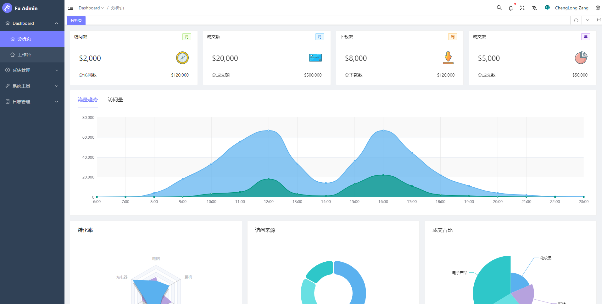
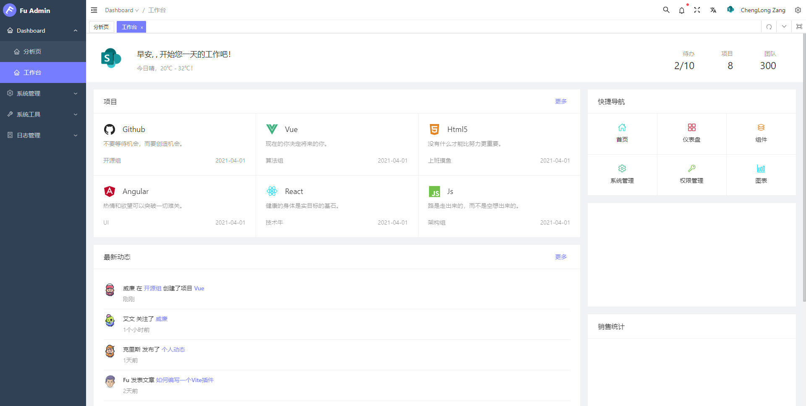
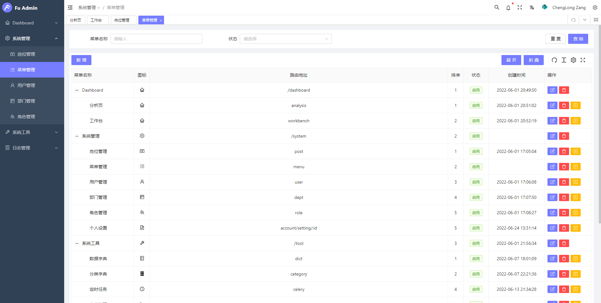
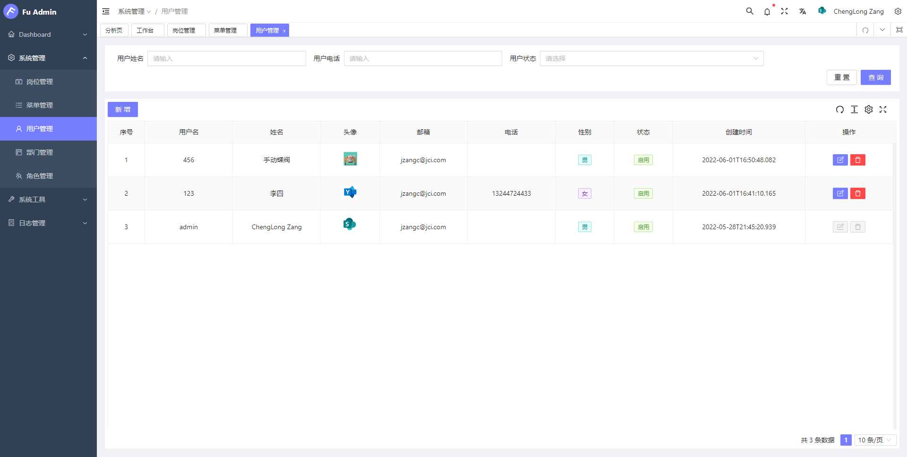
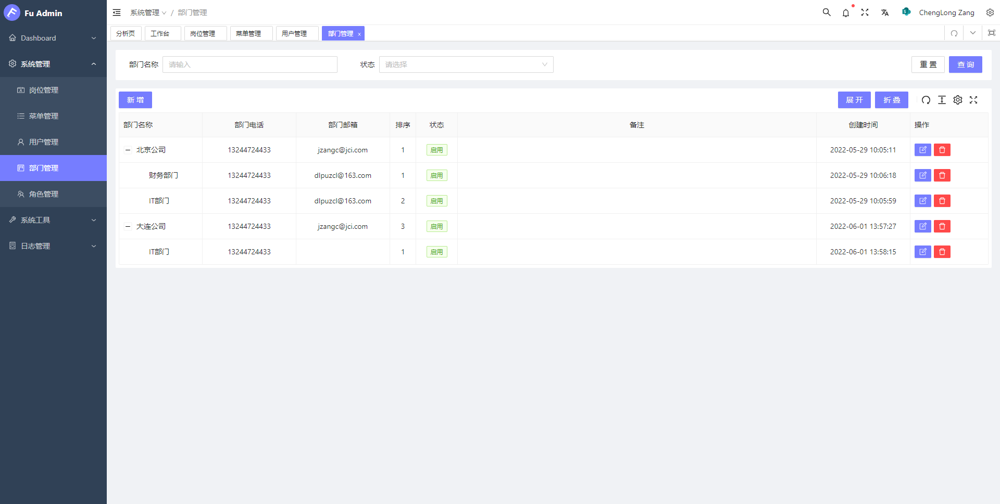
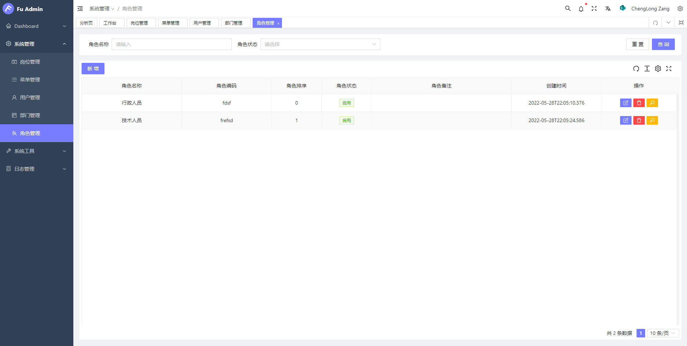
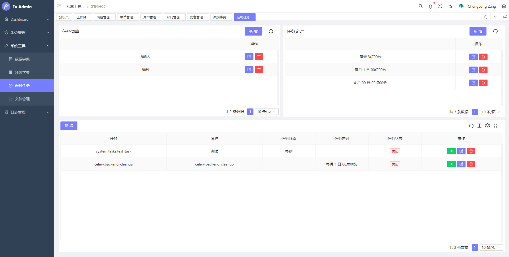
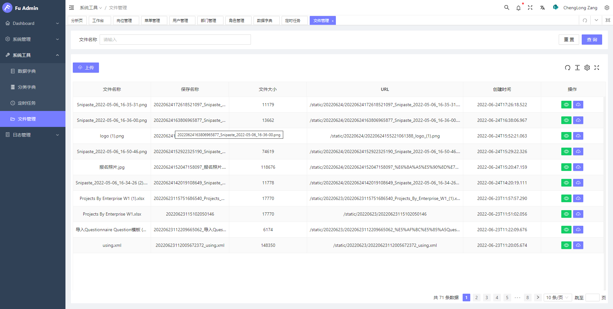
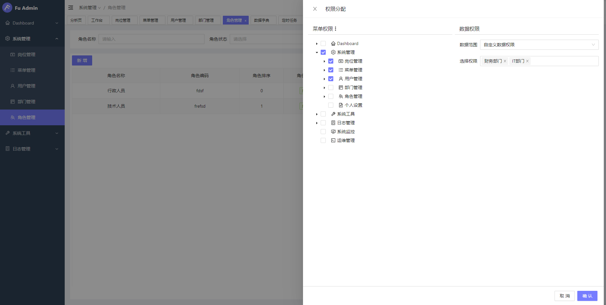

# FuAdmin

[](https://gitee.com/fuadmin/fu-admin/blob/master/LICENSE) [](https://python.org/) [](https://docs.djangoproject.com/zh-hans/4.0.4/) [](https://nodejs.org/zh-cn/) [](https://gitee.com/fuadmin/fu-admin) [](https://github.com/FuAdmin/FuAdmin)

## 🔥 工作流发布啦
- 视频介绍：[跳转到B站](https://www.bilibili.com/video/BV15VwpenENV/?spm_id_from=333.1387.homepage.video_card.click&vd_source=3d1f6ee11a3d0c3c90c2fc451d101524)
- 体验地址：[http://124.222.210.96:6060](http://124.222.210.96:8080)
---
- 官方文档：[http://124.222.210.96](http://124.222.210.96)
- 专业版预览：[http://124.222.210.96:8080](http://124.222.210.96:8080)
- 开源版预览：[http://124.222.210.96:6060](http://124.222.210.96:6060)
## Fast Api版
- 源码地址：https://gitee.com/fuadmin/fu-fastapi-vue
- FastApi 专业版预览：http://124.222.210.96:7070
- FastApi 开源版预览：http://124.222.210.96:9090

## 为什么使用 Django-Ninja 和 Vue3

💡 **「Django Ninja 相比于 Django Rest Framework 」**

- 简单：旨在易于使用和直观，直接使用@装饰器（java好像叫注解）开发api

- 快速执行：由于 Pydantic 和异步的支持，性能非常高。

- 快速编码：输入提示和自动文档让您只关注业务逻辑。

- 基于标准：基于 API 的开放标准：OpenAPI（以前称为 Swagger）和 JSON Schema。

- Django 集成：与 Django 自身的功能和 ORM 有很好的集成。


💡 **「Vue3 」**

- 最火的框架，国内最火的前端框架之一。
- 性能提升，运行速度是 vue2 的 1.5 倍。
- 体积更小，按需编译体积 vue2 要更小。
- 类型推断，更好的支持 ts 这个也是趋势。
- 高级给予，暴露了更底层的 API 和提供更先进的内置组件。
- 组合 API，能够更好的组织逻辑，封装逻辑，复用逻辑

## 平台简介

💡 [fu-admin-web](https://gitee.com/fuadmin/fu-admin/tree/master/web) 采用 VUE3，TS 开发。 💡 [fu-admin-backend](https://gitee.com/fuadmin/fu-admin/tree/master/backend) 采用 Python，Django 和 Django-Ninija 开发。数据库支持MySql，SqlServer，Sqlite。

- 🧑‍🤝‍🧑 前端采用[VbenAdmin](https://vvbin.cn/doc-next) 、[Vue3](https://cn.vuejs.org/)、[Ant Design Vue](https://www.antdv.com/docs/vue/getting-started-cn)。
- 👭 后端采用 Python 语言 Django 框架以及强大的 [Django Ninja](https://django-ninja.rest-framework.com/)。
- 👬 支持加载动态权限菜单，多方式轻松权限控制。
- 💡 Vue2 项目移步[Dvadmin](https://gitee.com/liqianglog/django-vue-admin)
- 💏 特别鸣谢：[VbenAdmin](https://github.com/vbenjs/vue-vben-admin) 、[Ant Design Vue](https://github.com/vueComponent/ant-design-vue)、[GoView](https://mtruning.club/)
- 💡 特别感谢[jetbrains](https://www.jetbrains.com/) 为本开源项目提供免费的 IntelliJ IDEA 授权。

## 在线体验

👩‍👧‍👦 演示地址：http://124.222.210.96:8080

- 账号：superadmin

- 密码：123456


## 交流

- FuAdmin 交流群：
- 群1: 726947525(已满)
- 群2: 531614582

## 源码地址

|        | 项目地址                            |
| ------ | ----------------------------------- |
| github | https://github.com/FuAdmin/fu-admin |
| 码云   | https://gitee.com/fuadmin/fu-admin  |

## 内置功能

1. 👨‍⚕️ 菜单管理：配置系统菜单，操作权限，按钮权限标识、后端接口权限等。
2. 🧑‍⚕️ 部门管理：配置系统组织机构（公司、部门、角色）。
3. 👩‍⚕️ 角色管理：角色菜单权限分配、数据权限分配、设置角色按部门进行数据范围权限划分。
4. 🧑‍🎓 权限权限：授权角色的权限范围。
5. 👨‍🎓 用户管理：用户是系统操作者，该功能主要完成系统用户配置。
6. 🧑‍🔧 数据字典：对系统中经常使用的一些较为固定的数据进行维护。
7. 🧑‍🔧 分类字典：对系统中经常使用的一些树形数据进行维护。
8. 📁 附件管理：对平台上所有文件、图片等进行统一管理。
9. 🗓️ 操作日志：系统正常操作日志记录和查询；系统异常信息日志记录和查询。
10. 定时任务：系统设置定时任务。

## 准备工作

```
Python >= 3.10.0 (推荐3.10+版本)
nodejs >= 18.0 (推荐最新)
Mysql >= 8.0 (可选，默认数据库sqlite3，推荐8.0版本)
Redis (默认需要，推荐最新版，可修改后台项目的cache配置)
```

## 前端 ♝

必须使用pnpm，项目提供了`pnpm-lock.yaml`，使用其他包管理器，容易出现版本依赖问题。

```bash
# 克隆项目
git clone https://gitee.com/fuadmin/fu-admin.git

# 进入项目目录
cd fu-admin/web

# 安装依赖
pnpm install --registry=https://registry.npmmirror.com

# 启动服务
pnpm dev
# 浏览器访问 https://localhost:8080
# .env 文件中可配置启动端口等参数
# 构建生产环境
# pnpm build
```

## 后端 💈

```bash
# 克隆项目
git clone https://gitee.com/fuadmin/fu-admin.git
# 进入项目目录
cd fu-admin/backend
# 在 `env.py` 中配置数据库信息
# 默认是Mysql，如果使用SqlServer，请在requirements.txt中打开 
    mssql-django==1.1.2 
    pyodbc==4.0.32
# 安装依赖环境
pip install -r requirements.txt
# 执行迁移命令：
python manage.py makemigrations system
python manage.py migrate
# 初始化数据
python manage.py init
# 启动项目
python manage.py runserver 0.0.0.0:8000
# 或使用 daphne :
daphne -b 0.0.0.0 -p 8000 fuadmin.asgi:application
```

### 访问项目

- 文档访问地址：[https://localhost:8080/api/docs](https://localhost:8080/api/docs) (默认为此地址，如有修改请按照配置文件)
- 账号：`superadmin` 密码：`123456`

## 演示图 ✅
 
 
 
 
 
 
 
 
 


## Docker构建

请参考文档[Docker构建](docker/README.md)

